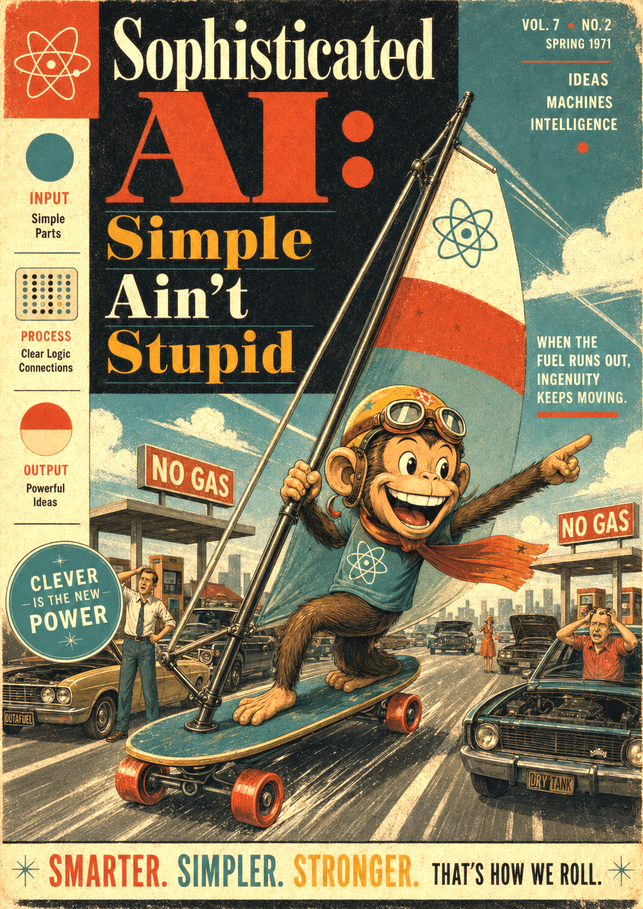

# Sophisticated AI: Simple Ain't Stupid

Tim Menzies   
timm@ieee.org

> "Simplicity is the ultimate sophistication"         
> - William Gaddis, The Recognitions (1955) p. 457; 

## 1. Introduction

{#logo width=400}

Everybody knows that AI has to be  very complicated, right? Serious
AI needs a trillion parameters, at the very least. Serious models
cost tens of millions of dollars to train, and hundreds of dollars
a day to run. No one can say how they work, which only proves how
advanced they are. Naturally, we must be nervous about everything
they tell us; that is the price of progress. In this view,
sophistication means size.

But  everybody also knows that sophistication of that size has
problems. Big AI is a rented telescope: powerful, but pointed by
someone else. Only a few large companies can pay for such training,
so science now depends on tools that science cannot inspect. The
models change without notice, so yesterday's results may not run
tomorrow. Their answers can be wrong in confident ways, so every
output needs a human check. Also, each new model asks for exponentially
more, so we keep running out of the environmental, power, and
financial resources this kind of AI needs.

In fairness, AI is not always simple; some problems truly need
the big machinery. The current trap runs the other way: we assume
complexity without first checking if it is necessary. This book is
that check. The next chapters collect our simple methods: AI that
explains itself, that trains useful models in milliseconds, from
very little data. As you read them, keep score. For your own work,
how often would these shortcuts be enough?

We make this concrete with an example. Suppose we want to buy a
car. Someone tells us that a good car accelerates quickly, uses
less fuel, and weighs less (since a lighter car is cheaper to
build, and cheaper to buy). Now someone offers us this car:

    Clndrs, Volume, HpX, Model, origin, Lbs-, Acc+, Mpg+
         4,    140,  92,    76,      1, 2572, 14.9,   30

What would an AI know about this car? It could tell us if this car
is unusual, or worthwhiile to buy. Maybe it could find us a better
car.  And if we must buy this car, our AI  could say what changes
to the car would help it, the most.

This table lists many other ways our AI could support us:

| task                                             | AI tool                   |
|--------------------------------------------------|:-------------------------:|
| Guess the fuel use before we see the sticker     | prediction                |
| Spot a strange car: a typo, or a scam            | anomaly detection         |
| Notice when the lot quietly changes under us     | drift                     |
| Say why a car is slow, or thirsty                | diagnosis                 |
| 400 cars, one afternoon, what to inspect first?  | triage                    |
| Justify any of the above to a skeptical buyer    | explanation               |
| Find the best car, test-driving very few         | optimization              |
| Chart a path from this car to a better one       | planning                  |
| Find the cheapest change that fixes this car     | repair                    |
| Sketch a better car from halves of two others    | synthesis                 |
| Shrink 400 cars to the dozen that summarize      | compression               |
| Trade fast against light against cheap           | multi-objective trade-off |
| Decide on the spot as cars arrive one at a time  | streaming                 |
| Keep learning for years as the market moves      | lifelong active learning  |
| Say how much to trust all these answers          | statistical certification |
| Teach the next intern to run the lot             | agent onboarding          |

This book makes two claims. First, behind the curtain, these
sixteen tools are almost the same. That is, the same few hundred
lines of Python sit under all of them, and most chapters of this
book add only a few dozen lines more.

Second, each task in the table is simpler than its reputation
because, often, _AI is simple_.
The next chapter shows that, mathematically, finding good
solutions for any of these tasks can be surprisingly easy. Thus,
"simple" and "does much" do not conflict. William Gaddis (quote
above) would call this approach highly sophisticated. The
sophistication of this AI is not in its size. It is in how little
the AI needs:

- No trillion parameters
- Usually, less than a hundred rows of data.

So we end this introduction with an invitation. Reflect on these
examples. Then check, for yourself, if the simpler approach to AI
is also the more sophisticated one.

### Audience

This book is for anyone worried that, flying over details with
LLMs, we miss what happens under the hood.  It is a book of deep study;
of mastery; of long-term creation inspred by Donald Knuth who
famously said:

> ... is a wonderful thing for people whose role in life is to
> be on top of things. But not for me; my role is to be on the
> bottom of things.

These chapters go down to the bottom of AI's machinery. Once
there, we report good news: much of that machinery can be simplified,
then shared across many AI tasks. The book maps those low-level
details in working code, after the manner of two classics of the
code walk-through: Lions' commentary on UNIX[^lions] and
Norvig's paradigms of AI programming, in Lisp[^norvig]. It
tries (but  may not always succeed) to be worthy of that company.

To present those low-level details, we use Python.
If you are not familiar with that language then
before starting here, maybe you should first read Downey's *Think Python*[^downey],
Matthes' *Python Crash Course*[^matthes], or Grus's *Data
Science from Scratch*[^grus].

[^lions]: John Lions, "Lions' Commentary on UNIX 6th Edition,
with Source Code", 1977.

[^norvig]: Peter Norvig, "Paradigms of Artificial Intelligence
Programming: Case Studies in Common Lisp", Morgan Kaufmann, 1992.

[^downey]: Allen Downey, "Think Python", 3rd ed., O'Reilly, 2024.

[^matthes]: Eric Matthes, "Python Crash Course", 3rd ed.,
No Starch Press, 2023.

[^grus]: Joel Grus, "Data Science from Scratch", 2nd ed.,
O'Reilly, 2019.

The last one also previews this book's habit: build the tools yourself.

## 2. Some AI is Simple?

(If maths is not your thing, feel free to skip this chapter.)

Some AI problems are very, very hard. Suppose we want an agent
that is ready for anything. Then we must collect enough
experience, in advance, to cover all future situations. This is
reward-free exploration: learn a model of everything, before
anyone says what "good" means. The theory prices that appetite.
For S states, A actions, plans of length H, accuracy e, and
confidence C, the samples needed are[^howlow]:

    n(reward free)  >=  S^2 * A * H^3 * log(1/(1-C)) / e^2   (1)

Even small problems make reward-free exploration expensive.
Consider one-step plans (H=1) over six variables with six states
each (A=6^6). Set e=0.05 and C=0.95; that is, we want 95% of the
optimum, with 95% confidence. Equation (1) then asks for at least
4.6 x 10^15 samples. So reward-free reasoning is Big AI: the kind
of problem that really does need vast data, vast computers, and
vast money.

Some AI problems are simpler than that. If someone does tell us
what "good" means, optimization becomes best-arm identification,
also called the bandit problem. Pull the most promising levers.
Drop the duds early. Hoeffding's inequality prices the search
across A alternatives:

    n(best arm)  >=  (2 / e^2) * log(2A / (1-C))              (2)

For the same problem as above, equation (2) needs only 6,992
samples. That cost is far below equation (1). But seven thousand
labels is still months of work, when each label needs a human
check or a long computer run.

Happily, some problems are even simpler. Let us admit that our
work is not an exact science. All our data is a small sample of
some larger phenomenon. In this statistical view, we do not want
the best solution. We just want one that is indistinguishable
from best. Call this near-enough optimization, or NEO. One random
guess lands in the top p fraction with probability p. Thus, n
guesses succeed at least once with probability 1-(1-p)^n. That
equation rearranges to:

    n(neo)  >  log(1-C) / log(1-p)                            (3)

How big is p? Cohen tells us that two numbers are
indistinguishable when their difference is under 20% of their
standard deviation.[^cohen] Suppose our scores are Gaussian; that
is, the bell curve, which effectively runs from -3sd to +3sd, a
spread of 6sd. Then that 20% covers p = 0.2/6, which is about 3%
of the whole range. Set p=0.03 and C=0.95. Equation (3) then asks
for about 98 samples. Call NEO small AI. A hundred labels is an
afternoon, not a data center.

One more assumption makes this simpler again. It is not
unreasonable to think that someone has modeled this kind of
problem before. If so, their old model can guess which of two new
solutions is better. Such guesses let us explore new data with a
binary chop. This method, called FASTNEO, needs only:

    n(fastneo)  >  log2( log(1-C) / log(1-p) )                (4)

Equation (4) says log2(98) samples, which rounds up to seven.
Seven. Fifteen orders of magnitude separate equation (1) from
equation (4). Hence the plan of this book: hunt for the tasks
where near enough is good enough. And this is not only theory. On
more than 100 SE optimization tasks, a few dozen labels reached
over 90% of the best known results[^howlow].

[^cohen]: J. Cohen, "Statistical Power Analysis for the
  Behavioral Sciences", 2nd ed., Lawrence Erlbaum, 1988.
  There, d = 0.2 standard deviations marks a "small" effect.

Nor is that one paper's quirk. Decades of results say that
software problems often shrink to a few "keys": a few variables,
or a few rows, that control the rest[^keys]. For example:

- Defect predictors work with less than half a dozen static code
  attributes.[^k1]
- Effort estimation needs only small, well-chosen data.[^k2]
- Security review of 28,750 Mozilla functions needed only 271
  labeled exemplars.[^k3]
- Labeling 6,000 GitHub commits needed only 300 exemplars.[^k4]
- Configuring complex systems needs only tiny decision
  trees.[^k5]
- Sampling plus simple learners predicts the performance of
  configurable systems.[^k6]
- Cloud data applications can be tested with a few dozen
  inputs.[^k7]
- Test suites shrink by orders of magnitude when tests only cover
  the keys.[^k8]
- Issue lifetimes are predicted by very simple models.[^k9]
- Simple parameter tuning beats complex deep analytics for many
  SE tasks.[^k10]
- NASA requirements models collapse to a few control
  variables.[^k11]
- Avionics control systems reduce to a few automatically found
  variables.[^k12]
- Real code is repetitive, so its statistics are simple and
  exploitable.[^k13]
- 20% of the code holds 80% of the errors.[^k14]
- Power laws in fine-grained changes explain why: developers work
  in small corners.[^k15]
- Most rows can be discarded without losing the signal.[^k16]
- Most columns can be discarded, too.[^k17]
- SAT solvers race when a few "backdoor" variables are set
  first.[^k18]
- A few principal components usually carry the signal; the oldest
  key-finder of all.[^k19]
- Even outside computing: hospital nutrition audits reduce to a
  few items.[^k20]

[^keys]: T. Menzies, "Shockingly Simple: 'Keys' for Better AI for
  SE", IEEE Software 38(2), 2021, doi:10.1109/MS.2020.3043014.
  That column collects the sightings above.

[^k1]: T. Menzies, J. Greenwald, and A. Frank, "Data mining
  static code attributes to learn defect predictors", IEEE Trans.
  Software Eng. 33(1):2-13, 2007. doi:10.1109/TSE.2007.256941
[^k2]: Z. Chen, T. Menzies, D. Port, and B. Boehm, "Finding the
  right data for software cost modeling", IEEE Software
  22(6):38-46, 2005. doi:10.1109/MS.2005.151
[^k3]: Z. Yu, C. Theisen, L. Williams, and T. Menzies, "Improving
  vulnerability inspection efficiency using active learning",
  IEEE Trans. Software Eng., 2019. doi:10.1109/TSE.2019.2949275
[^k4]: H. Tu, Z. Yu, and T. Menzies, "Better data labelling with
  EMBLEM (and how that impacts defect prediction)", IEEE Trans.
  Software Eng., 2020. doi:10.1109/TSE.2020.2986415
[^k5]: V. Nair, Z. Yu, T. Menzies, N. Siegmund, and S. Apel,
  "Finding faster configurations using FLASH", IEEE Trans.
  Software Eng. 46(7):794-811, 2020. doi:10.1109/TSE.2018.2870895
[^k6]: C. Kaltenecker, A. Grebhahn, N. Siegmund, and S. Apel,
  "The interplay of sampling and machine learning for software
  performance prediction", IEEE Software 37(4):58-66, 2020.
  doi:10.1109/MS.2020.2987024
[^k7]: Q. Zhang, J. Wang, M.A. Gulzar, R. Padhye, and M. Kim,
  "BigFuzz: efficient fuzz testing for data analytics using
  framework abstraction", ASE 2020.
[^k8]: J. Chen, X. Shen, and T. Menzies, "Building very small
  test suites (with SNAP)", arXiv:1905.05358, 2019.
[^k9]: M. Rees-Jones, M. Martin, and T. Menzies, "Better
  predictors for issue lifetime", arXiv:1702.07735, 2017.
[^k10]: A. Agrawal, W. Fu, D. Chen, X. Shen, and T. Menzies, "How
  to 'DODGE' complex software analytics", IEEE Trans. Software
  Eng., 2019. doi:10.1109/TSE.2019.2945020
[^k11]: G. Mathew, T. Menzies, N. Ernst, and J. Klein, "'SHORT'er
  reasoning about larger requirements models", RE 2017,
  pp.154-163, doi:10.1109/RE.2017.31; M.S. Feather and T.
  Menzies, "Converging on the optimal attainment of
  requirements", RE 2002, pp.263-270,
  doi:10.1109/ICRE.2002.1048537
[^k12]: G. Gay, T. Menzies, M. Davies, and K. Gundy-Burlet,
  "Automatically finding the control variables for complex system
  behavior", Automated Software Eng. 17(4):439-468, 2010.
  doi:10.1007/s10515-010-0072-x
[^k13]: A. Hindle, E.T. Barr, Z. Su, M. Gabel, and P. Devanbu,
  "On the naturalness of software", ICSE 2012, pp.837-847.
[^k14]: T.J. Ostrand, E.J. Weyuker, and R.M. Bell, "Where the
  bugs are", ACM SIGSOFT Software Eng. Notes 29(4):86-96, 2004,
  doi:10.1145/1013886.1007524; M. Hamill and K. Goseva-
  Popstojanova, "Common trends in software fault and failure
  data", IEEE Trans. Software Eng. 35(4):484-496, 2009.
  doi:10.1109/TSE.2009.3
[^k15]: Z. Lin and J. Whitehead, "Why power laws? An explanation
  from fine-grained code changes", MSR 2015, pp.68-75.
  doi:10.1109/MSR.2015.14
[^k16]: J.A. Olvera-Lopez, J.A. Carrasco-Ochoa, J.F. Martinez-
  Trinidad, and J. Kittler, "A review of instance selection
  methods", Artificial Intelligence Review 34(2):133-143, 2010.
  doi:10.1007/s10462-010-9165-y
[^k17]: R. Kohavi and G.H. John, "Wrappers for feature subset
  selection", Artificial Intelligence 97(1-2):273-324, 1997.
  doi:10.1016/S0004-3702(97)00043-X
[^k18]: R. Williams, C.P. Gomes, and B. Selman, "Backdoors to
  typical case complexity", IJCAI 2003, pp.1173-1178.
[^k19]: K. Pearson, "On lines and planes of closest fit to
  systems of points in space", Philosophical Magazine
  2(11):559-572, 1901. doi:10.1080/14786440109462720
[^k20]: S.N. Partington, T.J. Menzies, T.A. Colburn, B.E.
  Saelens, and K. Glanz, "Reduced-item food audits based on the
  nutrition environment measures surveys", American J. Preventive
  Medicine 49(4):e23-e33, 2015. doi:10.1016/j.amepre.2015.04.036

Twenty sightings, one moral: the above maths is not necessarily
crazy. Systems that look huge are often governed by a few keys,
and a few keys need only a few samples.

[^howlow]: Kishan Kumar Ganguly and Tim Menzies, "How Low
  Can You Go? The Data-Light SE Challenge",
  arXiv:2512.13524.

Two caveats:

- For mission-critical and safety-critical systems, we would
  rather be exactly at the best, not near it. But you cannot
  always get what you want. Only small systems can be
  exhaustively enumerated. Beyond a (surprisingly small) size,
  partial sampling is all that anyone can do. Hence even the
  critical systems need this maths.

- The above maths is optimistic. It assumes well-spread
  solutions, gentle distributions, and a host of other
  conditions that need not hold. And yet, as we shall see, it
  is remarkable how well this optimism holds up in practice.

The rest of this book checks this maths. That check waits a few
chapters. First, we need some basic tools, definitions of core
concepts, and a large corpus of data to explore. But by about
Chapter 7, we will show that the optimism of the above maths is
not misplaced. That result enables a whole new kind of
sophisticated, simple AI.

## The Basic

We can answer these questions with two basic AI operators:
"cluster" and "predict". Clustering groups related things
together. Prediction reports the expected value within the
relevant group.

    Clndrs, Volume, HpX, Model, origin, Lbs-, Acc+, Mpg+, | disty

         4,     90,  48,    78,      2, 1985, 21.5,   40, |  0.07
         4,     98,  68,    78,      1, 2155, 16.5,   30, |  0.26
        ...
         4,    140,  92,    76,      1, 2572, 14.9,   30, |  0.41
         4,     97,  54,    72,      2, 2254, 23.5,   20, |  0.41
        ...
         6,    131, 103,    78,      2, 2830, 15.9,   20, |  0.54
         6,    232, 100,    71,      1, 3288, 15.5,   20, |  0.62
         8,    305, 145,    77,      1, 3880, 12.5,   20, |  0.81
         8,    454, 220,    70,      1, 4354,    9,   10, |  0.96

The first thing we need to do is

### Lessons:

- Don't think, remember.

# References

Donald E. Knuth, on why he gave up email in 1990:
knuth.stanford.edu (personal site).

